- [1. 物像关系](#1-物像关系)
- [2. FOV](#2-fov)
- [3. 相机参数](#3-相机参数)
  - [3.1. 内参](#31-内参)
  - [3.2. 外参](#32-外参)
- [4. 坐标系](#4-坐标系)
  - [4.1. 右手坐标系 right-handed coordinates](#41-右手坐标系-right-handed-coordinates)
  - [4.2. 各种右手的相机坐标系](#42-各种右手的相机坐标系)
- [5. Frame Transforms](#5-frame-transforms)
  - [5.1. 世界坐标系\<-\>相机坐标系](#51-世界坐标系-相机坐标系)
  - [5.2. 透射](#52-透射)
    - [5.2.1. 相机坐标系\<-\>图像坐标系](#521-相机坐标系-图像坐标系)
    - [5.2.2. 图像坐标系\<-\>像素坐标系](#522-图像坐标系-像素坐标系)
  - [5.3. 综合](#53-综合)
- [反向](#反向)

---
## 1. 物像关系

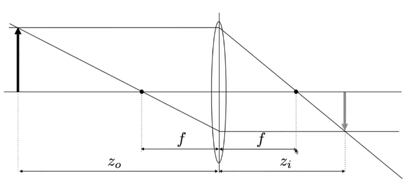  

  


$\dfrac{1}{f} = \dfrac{1}{z_0} + \dfrac{1}{z_i}$

f为焦距， $z_0$为物距（物体到透镜的距离）， $z_i$为像距（透镜到像面的距离）。


[由此可以推出不同的成像关系](https://www.zhihu.com/question/38929736/answer/2327108553)

## 2. FOV
视场 Field of view（FOV），是一个角度。

> 当传感器大小固定时，焦距越短，FOV越大；焦距越长，FOV越小。


> 当焦距固定时，传感器大小越小，FOV越小。

  


> 公式就是tan三角函数联系起焦距与高宽、或物距与物高宽。

  


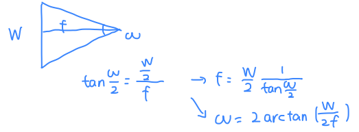  

W是图像的宽度（传感器大小），$\omega$是x轴的视角宽度，f是焦距。
```python
# `camera_angle_x`即在x轴的视角，对应图像的宽度。
focal = .5 * W / np.tan(.5 * camera_angle_x)
```
`"camera_angle_x": 0.5235987755982988,` 就是比如30°， Π/6 = 0.5235987755982988

`W`的单位是pixel， f的单位也是pixel。


> 镜头参数

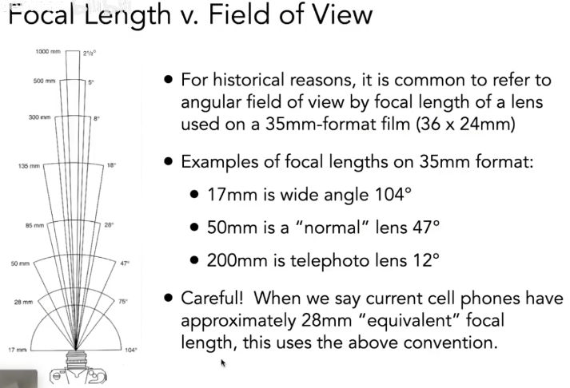  

我们以35mm-format的底片大小为标准，17mm、50mm、200mm、28mm的焦距是在这样大小的底片上，这个焦距是等效的虚指。意思是，实际手机镜头的焦距很小，对应的也是很小的底片大小。

拍照的效果就是，视场越窄，镜头拍到的就越远。

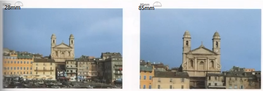  

> maintain same FOV

  


## 3. 相机参数

相机两个参数：内参和外参

- 外参extrinsics，即**M**
    描述相机的位姿（位置t是指相机在空间中的哪个地方，而姿态R则是指相机的朝向）

- 内参intrinsics，即**K**
    固定不变的，如果不知道可以通过**标定**求得。

- 内参共有，外参变化：
    由于多组图片都是同一个相机拍摄得到，所以其内参数由多组图像共有，而外参数随着不同的图像将发生变化
- 都用齐次坐标表示
  

### 3.1. 内参

透射：The intrinsic matrix transforms 3D camera cooordinates to 2D homogeneous image coordinates.

$K = \begin{bmatrix} \alpha f_x & s & c_x\\ 0 & \beta f_y & c_y\\ 0 & 0 & 1\end{bmatrix}$

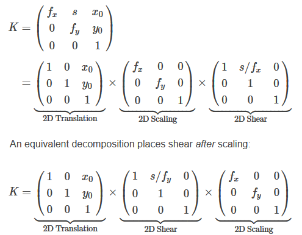  

平移操作放在最后（即最左）。

在内参矩阵中还有个参数 $s$（通常也可当成0），用来建模像素是平行四边形而不是矩形，与像素坐标系的u，v轴之间的夹角$\theta$的正切值$tan(\theta)$成反比，因此当 $s = 0$时，表示像素为矩形。

```python
# 缩放尺寸为1，不缩放
# 平移到图像中心
K = np.array([
    [focal, 0, 0.5*W],
    [0, focal, 0.5*H],
    [0, 0, 1]
])
```

### 3.2. 外参

let's consider **translation for points (positions)** and **rotations for vectors (directions)**.

> 相机外参是一个4x4的矩阵M。

相机外参叫做**world-to-camera (w2c)矩阵**，其作用是把3D世界坐标系的坐标变换到2D相机坐标系的坐标。

相机外参的逆矩阵被称为**camera-to-world (c2w)矩阵**，其作用是把2D相机坐标系的坐标变换到3D世界坐标系的坐标。

> **NeRF主要使用c2w**

c2w的含义: camera's pose matrix

c2w矩阵是一个4x4的矩阵，左上角3x3是旋转矩阵R，又上角的3x1向量是平移向量T。有时写的时候可以忽略最后一行[0,0,0,1]。

  
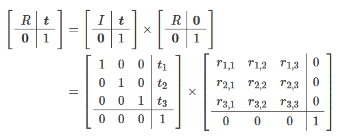  

- R
    $R \in SO(3)$
    $SO(n) = \{R \in \R^{n\times n}|RR^T=I,det(R)=1\}$
    - 旋转矩阵是一个正交矩阵, 正交矩阵的逆等于其转置矩阵。旋转矩阵的逆等于其转置矩阵
    - 行列式值为1

- M
    $M \in SE(3)$
    $SE(n) = \left\{T=\begin{bmatrix}R & t\\ 0^T & 1\end{bmatrix} \in \R^{4\times 4}|R\in SO(3),t\in \R^3\right\}$


 

The camera's extrinsic matrix describes the camera's location in the world, and what direction it's pointing

- 旋转矩阵的每一列分别表示了相机坐标系的XYZ轴方向在世界坐标系下对应的XYZ轴方向。
    R'columns are the directions of the camera-axes in the world coordinates.

- 平移向量表示的是相机原点在世界坐标中的位置。即后文讲的**世界坐标下看相机坐标原点的平移向量**。
    The sign of $t_x$, $t_y$, $t_z$ should reflect the position of the camera origin appears in the world coordinates.

- 意义：将相机坐标系与世界坐标系的转换分解为旋转和平移的过程。

    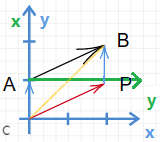  

    描述点B。在绿色坐标系下，B点(1,2)。在蓝色坐标系下，B点(2,2)。怎么转化？借助向量。

    描述向量AB。在绿色坐标系下，AB是起点(0,0)和方向向量(1,2)，即AB(1,2)=(0,0)+(1,2)。在蓝色坐标系下是CB=CA+AB, (2,2)=(0,1)+(2,1)。
    也即A点(0,1)和B点(2,2)=(1,2)-(-1,0)。
    怎么做到从绿色到蓝色？旋转坐标系，方向向量(2,1)变化为(1,2)，平移向量(-1,0)就是在绿色坐标系下观察的世界坐标系原点的位置。

    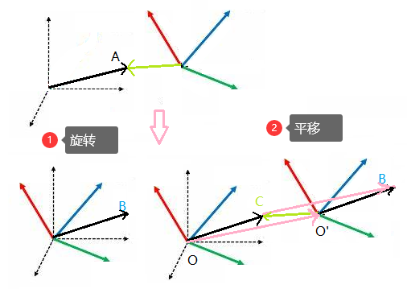  

    相机坐标系虚线坐标轴，世界坐标系彩色坐标轴。相机坐标的黑色OA，选转后世界坐标的OB，在相机坐标下看世界坐标原点的平移量是粉色的OO'，世界坐标的O'C = OB - OO'。

    也就是说，关键点，**世界坐标下的向量 = 旋转后的向量 - 相机坐标下看世界坐标原点的平移向量**，或者，****世界坐标下的向量 = 旋转后的向量 + 世界坐标下看相机坐标原点的平移向量****。后者才是矩阵中的 $t$。


## 4. 坐标系
坐标系 Coordinate Frames

  

Express motion information relative to a reference frame. 

参考坐标系 reference frame可以分为：
- Camera Frame
- World Frame

之后的图像坐标系和像素坐标系只有xy轴，且和相机坐标系的xy轴方向保持一致。
### 4.1. 右手坐标系 right-handed coordinates

手掌：用右手的**4个指头从a转向b**（合拳，而不是松拳），大拇指朝向就是aXb的方向。

三指：右手，大拇指a，食指b，中指的方向就是axb。（是大食中、食中大、中大食的升序，而不是中食大等的降序）

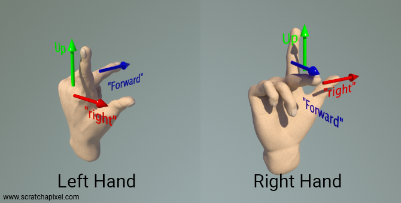  


> 将左右手性和right-up-forward联系在一起，而不是xyz

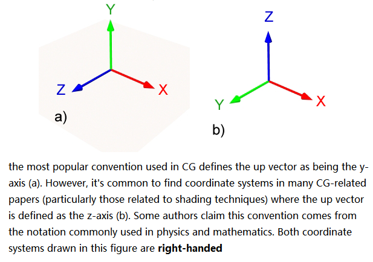  

图中b还是右手性，是认为up是z轴，按照right-up-forward来判断它还是右手性。

The only thing that defines the handedness of the coordinate system is the orientation of the left (or right) vector relative to the up and forward vectors, regardless of what these axes represent.

Currently, the industry standard tends to be the right-hand XYZ coordinate system where x points to the right, y is up, and z is backwards (coming out of the screen).
### 4.2. 各种右手的相机坐标系


  


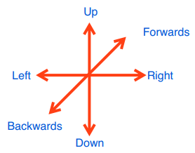  


  
  

或者
```python
# 补全成4x4的矩阵
# flip the sign of the y-axis (from down to up) and z-axis (from forwards to backwards)
camtoworlds_opengl = camtoworlds_opencv @ np.diag([1, -1, -1, 1])
```

## 5. Frame Transforms


图像的成像过程经历了世界坐标系—>相机坐标系—>图像坐标系—>像素坐标系这四个坐标系的转换，如下图所示：

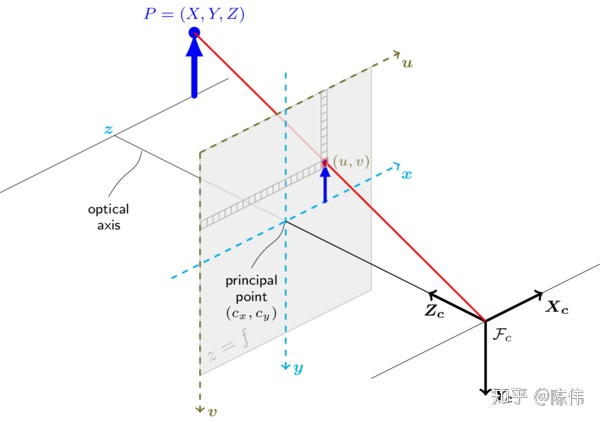  

- 像素坐标系 pixels coordinate：以图像平面左上角为原点的坐标系 ，X 轴和Y 轴分别平行于图像坐标系的 X 轴和Y 轴，用 $(u,v)$ 表示其坐标值。像素坐标系就是以像素为单位的图像坐标系。

- 图像坐标系 image coordinate：以光心在图像平面投影为原点的坐标系 ，X轴和Y 轴分别平行于图像平面的两条垂直边，用 $(x, y)$ 表示其坐标值。图像坐标系是用物理单位表示像素在图像中的位置。

- 相机坐标系 camera coordinate：以相机光心为原点的坐标系，X 轴和Y 轴分别平行于图像坐标系的 X 轴和Y 轴，相机的光轴为Z 轴，用 $(x_{c}, y_{c},z_{c})$ 表示其坐标值。

- 世界坐标系 world coordinate：是三维世界的绝对坐标系，我们需要用它来描述三维环境中的任何物体的位置，用 $(x_{w}, y_{w},z_{w})$ 表示其坐标值。

### 5.1. 世界坐标系<->相机坐标系

属于刚体变换，包括旋转和平移操作，通过六个自由度的外参矩阵反应了物体与相机的相对运动关系


- 世界坐标系的欧式点$P_{w}=[X_{w}, Y_{w}, Z_{w}]$，相机坐标系的欧式点$P_{c}=[X_{c}, Y_{c}, Z_{c}]$，

    $$P_{c}=RP_{w}+t$$

    $$\begin{bmatrix} X_{c} \\ Y_{c} \\ Z_{c}  \end{bmatrix}  
    = R \begin{bmatrix} X_{w} \\  Y_{w} \\ Z_{w}  \end{bmatrix} + \begin{bmatrix} t_{x} \\  t_{y} \\ t_{z}  \end{bmatrix}$$

- 世界坐标系的齐次坐标点$P_{w}=[X_{w}, Y_{w}, Z_{w}, 1]$，相机坐标系的欧式点$P_{c}=[X_{c}, Y_{c}, Z_{c}]$，

    $$P_{c}=\begin{bmatrix} R & T \end{bmatrix}P_{w}$$

    $$\begin{bmatrix} X_{c} \\ Y_{c} \\ Z_{c} \end{bmatrix}  
    = \begin{bmatrix} R & t \end{bmatrix}  \begin{bmatrix} X_{w} \\  Y_{w} \\ Z_{w} \\ 1 \end{bmatrix}$$

- 世界坐标系的齐次坐标点$P_{w}=[X_{w}, Y_{w}, Z_{w}, 1]$，相机坐标系的齐次坐标点$P_{c}=[X_{c}, Y_{c}, Z_{c}, 1]$，

    $$P_{c}=\begin{bmatrix} R & t \\ 0^T & 1 \end{bmatrix}P_{w}$$

    $$\begin{bmatrix} X_{c} \\ Y_{c} \\ Z_{c} \\ 1 \end{bmatrix}  
    = \begin{bmatrix} R & t \\ 0^T & 1  \end{bmatrix}  \begin{bmatrix} X_{w} \\  Y_{w} \\ Z_{w} \\ 1 \end{bmatrix}$$


例子：

$\begin{bmatrix} R & T \end{bmatrix}
\begin{bmatrix} \cos(\theta) \\ -\sin(\theta) \\ -\sin(\theta*zrate) \\ 1 \end{bmatrix}$

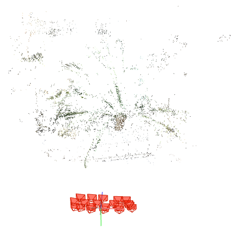  

colmap已经设定好了世界坐标系，外参也是依据此世界坐标系的。

### 5.2. 透射

#### 5.2.1. 相机坐标系<->图像坐标系

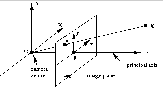  

图像坐标系(对应平面叫做image plane)的x和y轴方向和相机坐标系的保持一致。

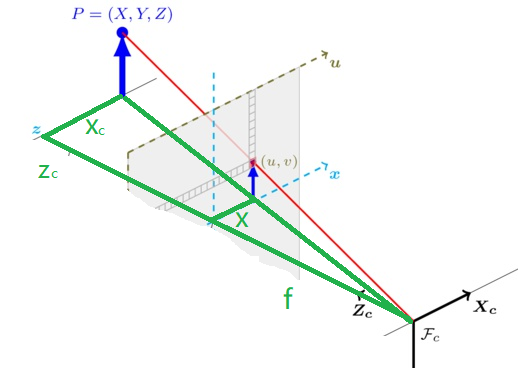  

从3D的相机坐标系下的欧式点 $(X_{c}, Y_{c}, Z_{c})$ 到2D的图像坐标系下的欧式点 $(x,y)$  

The focal length is the distance between the pinhole and image plane. 
$$\begin{aligned}
\dfrac{f}{Z_{c}} &= \dfrac{x}{X_c} = \dfrac{y}{Y_c}
\\ x&=f\dfrac{X_{c}}{Z_{c}}
\\ y&=f\dfrac{Y_{c}}{Z_{c}}\end{aligned}$$

$\begin{bmatrix} f_x & 0 & 0 & 0\\ 0 & f_y & 0 & 0\\ 0 & 0 & 1 & 0\end{bmatrix}  \begin{bmatrix} X_{c} \\  Y_{c} \\ Z_{c} \\ 1 \end{bmatrix}
=\begin{bmatrix} f_xX_c \\ f_yY_c \\ Z_c \end{bmatrix} 
=Z_c\begin{bmatrix} f_x\dfrac{X_{c}}{Z_{c}} \\ f_y\dfrac{Y_{c}}{Z_{c}} \\ 1 \end{bmatrix}
=Z_c\begin{bmatrix}x \\y \\1 \end{bmatrix}$

$\begin{bmatrix} f_x & 0 & 0\\ 0 & f_y & 0\\ 0 & 0 & 1\end{bmatrix}  \begin{bmatrix} X_{c} \\  Y_{c} \\ Z_{c}\end{bmatrix}
=\begin{bmatrix} f_xX_c \\ f_yY_c \\ Z_c \end{bmatrix} 
=Z_c\begin{bmatrix} f_x\dfrac{X_{c}}{Z_{c}} \\ f_y\dfrac{Y_{c}}{Z_{c}} \\ 1 \end{bmatrix}
=Z_c\begin{bmatrix}x \\y \\1 \end{bmatrix}$


PS：倒像问题

  

P点的x是负坐标，P'点的x是正坐标。

$$\dfrac{f}{Z_{c}} = -\dfrac{x}{X_c} = -\dfrac{y}{Y_C}$$

其中负号表示成的像是倒立的。为了简化模型，我们可以把成像平面对称到相机前方，和三维空间点一起放在摄像机坐标系的同一侧，这样做可以把公式中的负号去掉，使式子更加简洁。

  

#### 5.2.2. 图像坐标系<->像素坐标系

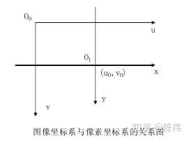  


像素坐标系：以左上角点为原点，u轴向右与x轴平行，v轴向右与y轴平行。像素坐标系和图像坐标系之间，相差了一个缩放 $\alpha, \beta$和原点的平移 $c_x, c_y$。

$$\begin{aligned}
u&=\alpha x + c_x
\\ v&=\beta y + c_y
\end{aligned}$$

$
Z_c \begin{bmatrix}\alpha & 0 & c_x \\0 & \beta & c_y \\ 0 & 0 & 1 \end{bmatrix}\begin{bmatrix}x \\y \\1 \end{bmatrix} = 
Z_c\begin{bmatrix} u \\v \\ 1\end{bmatrix}
$

### 5.3. 综合

 

$ Z_c\begin{bmatrix} u \\ v \\ 1\end{bmatrix} = KM_{w2c}P_w = K\left( R\begin{bmatrix} X_w \\ Y_w \\ Z_w \end{bmatrix} + t \right)$

- 世界坐标系的欧式点$P_{w}=[X_{w}, Y_{w}, Z_{w}]$，像素坐标的齐次坐标点 $P_{uv}=[u, v]$


    $$\begin{aligned}
    Z_c\begin{bmatrix} u \\ v \\ 1\end{bmatrix} 
    &= \begin{bmatrix} \alpha & 0 & c_x \\0 & \beta & c_y \\ 0 & 0 & 1 \end{bmatrix}
    \begin{bmatrix} f_x & 0 & 0\\ 0 & f_y & 0\\ 0 & 0 & 1\end{bmatrix}
    \begin{bmatrix} R & t\end{bmatrix}  \begin{bmatrix} X_{w} \\  Y_{w} \\ Z_{w} \\ 1 \end{bmatrix}
    \\ &= 
    \begin{bmatrix} \alpha f_x & 0 & c_x\\ 0 & \beta f_y & c_y\\ 0 & 0 & 1\end{bmatrix}
    \begin{bmatrix} R & t\end{bmatrix}  \begin{bmatrix} X_{w} \\  Y_{w} \\ Z_{w} \\ 1 \end{bmatrix}
    \\ &= KMP_w
    \end{aligned}
    $$


- 世界坐标系的齐次坐标点$P_{w}=[X_{w}, Y_{w}, Z_{w}, 1]$，像素坐标的齐次坐标点 $P_{uv}=[u, v]$

    $$\begin{aligned}
    Z_c\begin{bmatrix} u \\ v \\ 1\end{bmatrix} 
    &= \begin{bmatrix} \alpha & 0 & c_x \\0 & \beta & c_y \\ 0 & 0 & 1 \end{bmatrix}
    \begin{bmatrix} f_x & 0 & 0 & 0\\ 0 & f_y & 0 & 0\\ 0 & 0 & 1 & 0\end{bmatrix}
    \begin{bmatrix} R & t \\ 0^T & 1  \end{bmatrix}  \begin{bmatrix} X_{w} \\  Y_{w} \\ Z_{w} \\ 1 \end{bmatrix}
    \\ &= 
    \begin{bmatrix} \alpha f_x & 0 & c_x & 0\\ 0 & \beta f_y & c_y & 0\\ 0 & 0 & 1 & 0\end{bmatrix}
    \begin{bmatrix} R & t \\ 0^T & 1  \end{bmatrix}  \begin{bmatrix} X_{w} \\  Y_{w} \\ Z_{w} \\ 1 \end{bmatrix}
    \\ &= KMP_w
    \end{aligned}
    $$

**相机深度**$z_{c}$ 乘以 **像素坐标**$P_{uv}$ = **相机内参**K 乘以 **相机外参RT** 乘以 **世界坐标**$P_{w}$

像素坐标系下的一点可以被认为是三维空间中的一条射线， $z_{c}$ 就是像素点在相机坐标系下的深度。

## 反向

反向 $P_c \to P_w$

> w2c

w2c 可以通过 c2w 的逆

  

- c2w: $M_{c2w} = [R, t]$

    $$P_w = RK^{−1} \begin{bmatrix} v \\ u \\ 1 \end{bmatrix} + t $$

- w2c: $M_{w2c} = [R, t]$，相当于 c2w 形式为 $M_{c2w} = M_{w2c}^{-1} = [R^T, -R^Tt]$

    $$P_w = R^{T}K^{−1} \begin{bmatrix} v \\ u \\ 1 \end{bmatrix} + (-R^Tt)$$

    - a target pixel $x\in\mathbf{RP}^{2}$ , w2c extrinsics $[R | t]$ , intrinsics $K$ .
    - ray direction $v=R^{\top}K^{-1}x$
