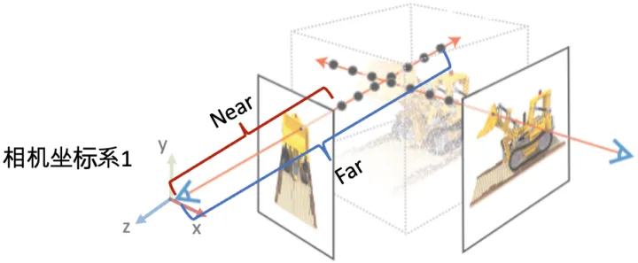
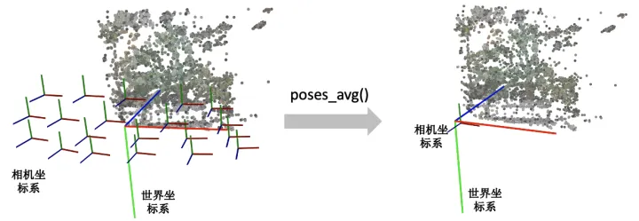

- [1. load\_llff\_data](#1-load_llff_data)
  - [1.1. other](#11-other)
    - [1.1.1. \_minify](#111-_minify)
  - [1.2. poses overview](#12-poses-overview)
    - [1.2.1. \_load\_data](#121-_load_data)
    - [1.2.2. recenter\_poses](#122-recenter_poses)

---
# 1. load_llff_data

[load_llff.py](../load_llff.py)

load_llff_data：
- 造图片的:_minify
- poses: 
    - _load_data
    - recenter_poses

- 其他基本：
    - normalize：向量的单位化
    - viewmatrix：求X轴的方向。
    - poses_avg：求多个输入相机的平均位姿c2w
    - ptstocam
    - render_path_spiral
    - spherify_poses

## 1.1. other

### 1.1.1. _minify

原本来自[LLFF](https://github.com/Fyusion/LLFF/blob/master/llff/poses/pose_utils.py#L195)

见 nerf_utils/utils/minify.py

## 1.2. poses overview

`_load_data`: 
1. `poses_bounds.npy`: `(N, 17)`
    这里的`poses_bounds.npy`是通过LLFF的`imgs2poses.py`生成的，pose matrix的方向是LLFF格式的DRB方向。
    
    Each row of length 17 gets reshaped into a 3x5 **pose matrix** and 2 **depth values** that bound the closest and farthest scene content from that point of view（是离相机远近）.
      
    
2. `poses`: (3, 5, N), `bds`: (2, N)
    **pose matrix**: is a 3x4 **camera-to-world** affine transform concatenated with a 3x1 column `[image height, image width, focal length]` (we assume the principal point is centered and that the focal length is the same for both x and y).
    
    

3. 重新赋值第五列的HW，按系数缩放F。

4. 此时返回的`pose`还是LLFF的**DRB方向**。[相机和nerf.md](./相机和nerf.md)

回到`load_llff_data`:

5. 调整方向LLFF的DRB方向到NeRF的RUB方向

6. 变成(N,...)的样本在第一维度的格式：`poses`: (N, 3, 5), `bds`: (N, 2), `images`: (N, H, W, C), [0, 1.0]范围。

7. `bd_factor`: 调整`bds`和poses的平移量t

8. `recenter_poses`: 中心化相机位姿。结果还是(N, 3, 5)

  

### 1.2.1. _load_data

原本来自[LLFF](https://github.com/Fyusion/LLFF/blob/master/llff/poses/pose_utils.py#L195)

### 1.2.2. recenter_poses
输入N个相机位姿，会返回N个中心化后的相机位姿（所有输入位姿的平均位姿和世界坐标系坐标轴对齐）：
1. `poses_avg(poses)`, 得到多个输入相机的平均位姿c2w（R和t）
      

2. 让平均位姿c2w和各个位姿poses，附加上[0,0,0,1]，变成完整的外参形式

3. 用平均位姿c2w的逆左乘到输入的相机位姿上就完成了中心化。

      

