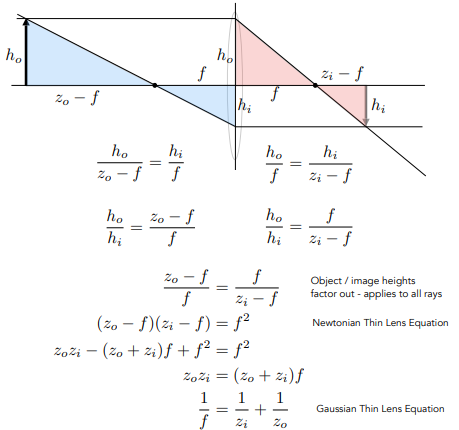
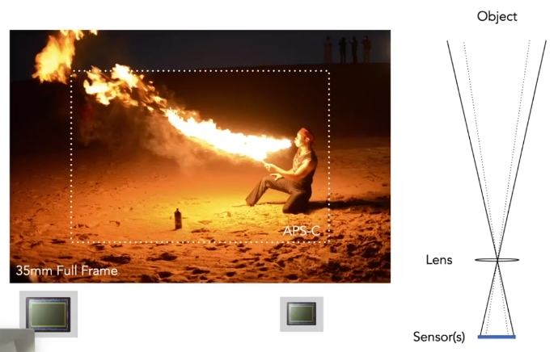
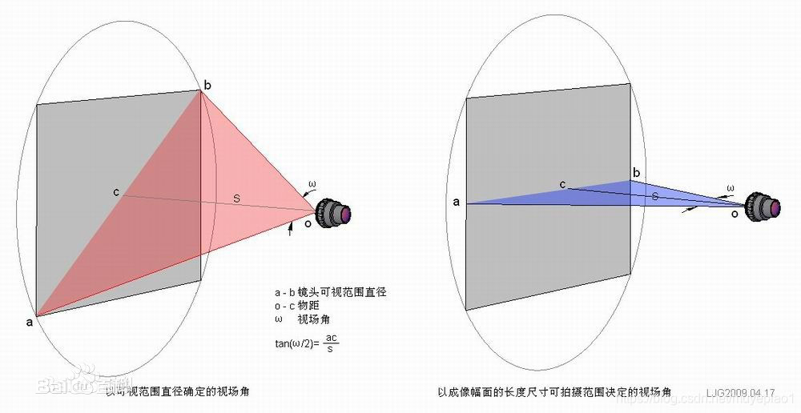
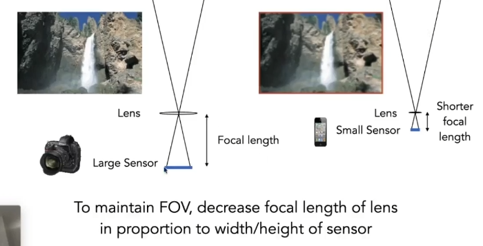
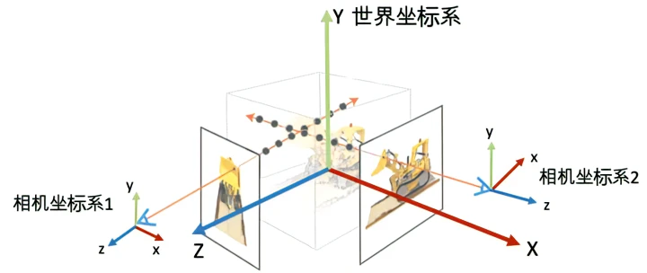

- [1. 物像关系](#1-物像关系)
- [2. FOV](#2-fov)
- [3. 相机坐标](#3-相机坐标)
  - [3.1. 内参](#31-内参)
  - [3.2. 外参](#32-外参)
- [4. 坐标系](#4-坐标系)

---
## 1. 物像关系

  

  


$\dfrac{1}{f} = \dfrac{1}{z_0} + \dfrac{1}{z_i}$

f为焦距， $z_0$为物距（物体到透镜的距离）， $z_i$为像距（透镜到像面的距离）。


[由此可以推出不同的成像关系](https://www.zhihu.com/question/38929736/answer/2327108553)

## 2. FOV
视场 Field of view（FOV），是一个角度。

> 当传感器大小固定时，焦距越短，FOV越大；焦距越长，FOV越小。


> 当焦距固定时，传感器大小越小，FOV越小。

  


> 公式就是tan三角函数联系起焦距与高宽、或物距与物高宽。

  


  

W是图像的宽度（传感器大小），$\omega$是x轴的视角宽度，f是焦距。
```python
# `camera_angle_x`即在x轴的视角，对应图像的宽度。
focal = .5 * W / np.tan(.5 * camera_angle_x)
```
`"camera_angle_x": 0.5235987755982988,` 就是比如30°， Π/6 = 0.5235987755982988

`W`的单位是pixel， f的单位也是pixel。


> 镜头参数

  

我们以35mm-format的底片大小为标准，17mm、50mm、200mm、28mm的焦距是在这样大小的底片上，这个焦距是等效的虚指。意思是，实际手机镜头的焦距很小，对应的也是很小的底片大小。

拍照的效果就是，视场越窄，镜头拍到的就越远。

  

> maintain same FOV

  


## 3. 相机坐标

相机两个参数：内参和外参
- 内参intrinsics，即**K**
    固定不变的，如果不知道可以通过**标定**求得。
- 外参extrinsics，即**T**
    描述相机的位姿，即变换矩阵（Transform Matrix），由旋转R和平移t组成。
- 内参共有，外参变化：
    由于多组图片都是同一个相机拍摄得到，所以其内参数由多组图像共有，而外参数随着不同的图像将发生变化
- 都用齐次坐标表示
  

### 3.1. 内参

  
  
  

```python
# 平移到图像中心
K = np.array([
    [focal, 0, 0.5*W],
    [0, focal, 0.5*H],
    [0, 0, 1]
])
```

### 3.2. 外参

相机外参是一个4x4的矩阵$T$，其作用是将世界坐标系的点$P_{world}=[x,y,z,1]$变换到相机坐标系下

$$P_{camera}=MP_{world}$$

我们也把相机外参叫做**world-to-camera (w2c)矩阵**。相机外参的逆矩阵被称为**camera-to-world (c2w)矩阵**。其作用是把相机坐标系的点变换到世界坐标系。

NeRF主要使用c2w，这里详细介绍一下c2w的含义。c2w矩阵是一个4x4的矩阵，左上角3x3是旋转矩阵R，又上角的3x1向量是平移向量T。有时写的时候可以忽略最后一行[0,0,0,1]。

  

- R
    $R \in SO(3)$
    $SO(n) = \{R \in \R^{n\times n}|RR^T=I,det(R)=1\}$
    - 旋转矩阵是一个正交矩阵, 正交矩阵的逆等于其转置矩阵。旋转矩阵的逆等于其转置矩阵
    - 行列式值为1

- M
    $M \in SE(3)$
    $SE(n) = \left\{T=\left[\begin{array}{cc}R & t\\ 0^T & 1\end{array}\right] \in \R^{4\times 4}|R\in SO(3),t\in \R^3\right\}$


  
旋转矩阵的第一列到第三列分别表示了相机坐标系的X, Y, Z轴在世界坐标系下对应的方向；平移向量表示的是相机原点在世界坐标系的对应位置。


## 4. 坐标系

右手法则，用右手的**4个指头从a转向b**，大拇指朝向就是aXb的方向。

  

> ABC对应XYZ

  


  

  


  
  
