- [1. homogenous coordinates](#1-homogenous-coordinates)
- [2. 2D transformations](#2-2d-transformations)
- [3. 变化可逆](#3-变化可逆)
- [4. 顺序](#4-顺序)

---

## 1. homogenous coordinates
- Affine map = linear map + translation 
$
\left[\begin{array}{l} x^{\prime}  \\y^{\prime}\end{array}\right] = 
\left[\begin{array}{cc}A & B \\C & D\end{array}\right]
\left[\begin{array}{l}x \\y\end{array}\right] +
\left[\begin{array}{l}t_x \\t_y\end{array}\right]
$

- use homogenous coordinates
$
\left[\begin{array}{l} x^{\prime}  \\y^{\prime} \\1 \end{array}\right] = 
\left[\begin{array}{cc}A & B & t_x \\C & D & t_y \\0 & 0 & 1\end{array}\right]
\left[\begin{array}{l}x \\y \\1\end{array}\right]
$

- $\left[\begin{array}{l}
x^{\prime} \\
y^{\prime} \\
z^{\prime} \\
1
\end{array}\right]
=\left[\begin{array}{lllc}
a & b & c & t_{x} \\
d & e & f & t_{y} \\
g & h & i & t_{z} \\
0 & 0 & 0 & 1
\end{array}\right] 
\cdot\left[\begin{array}{l}
x \\
y \\
z \\
1
\end{array}\right]$

Add a third coordinate (w-coordinate): 点升维加`1`，向量升维加`0`
- 2D point = $(x, y, 1)^T$
- 2D vector = $(x, y, 0)^T$
- 3D point = $(x, y, z, 1)^T$
- 3D vector = $(x, y, z, 0)^T$

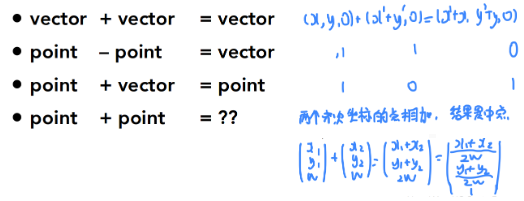  

PS:
- $(x, y, \omega)^T$ is the 2D point $(x/\omega, y/\omega, 1)^T$ $(\omega\neq0)$
- $(x, y, z, \omega)^T$ is the 2D point $(x/\omega, y/\omega, z/\omega, 1)^T$ $(\omega\neq0)$

## 2. 2D transformations

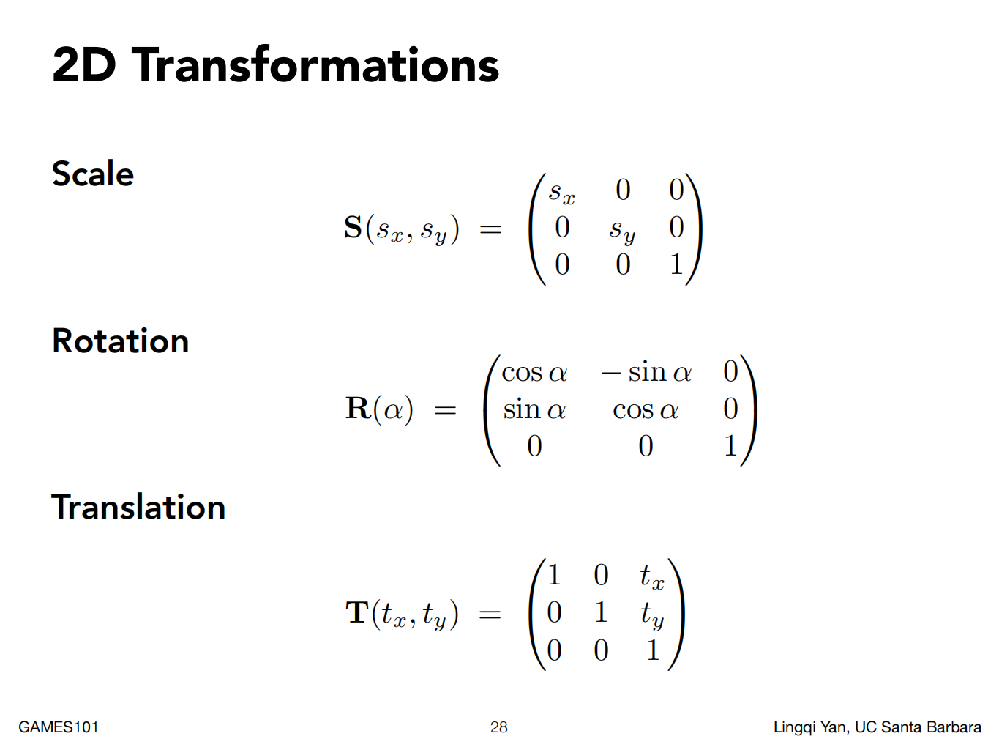

- Shear
    $
    \left[\begin{array}{l} x^{\prime}  \\y^{\prime}\end{array}\right] = 
    \left[\begin{array}{cc}1 & a \\0 & 1\end{array}\right]
    \left[\begin{array}{l}x \\y\end{array}\right]
    $
    
    具体方法，代入点算
    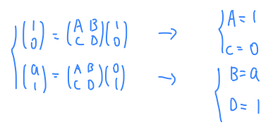  

    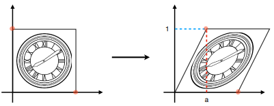  

- Scale
    $
    \left[\begin{array}{l} x^{\prime}  \\y^{\prime}\end{array}\right] = 
    \left[\begin{array}{cc}s_{x} & 0 \\0 & s_{y}\end{array}\right]
    \left[\begin{array}{l}x \\y\end{array}\right]
    $
    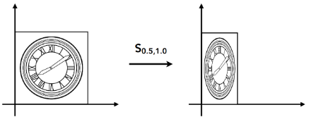  

- Reflection（沿着y轴对称）
    $
    \left[\begin{array}{l} x^{\prime}  \\y^{\prime}\end{array}\right] = 
    \left[\begin{array}{cc}-1 & 0 \\0 & 1\end{array}\right]
    \left[\begin{array}{l}x \\y\end{array}\right]
    $
    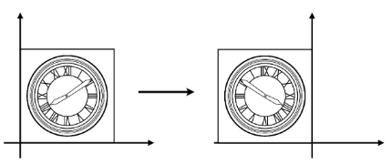  

- Rotate
    $
    \left[\begin{array}{l} x^{\prime}  \\y^{\prime}\end{array}\right] = 
    \left[\begin{array}{cc}\cos\theta & -\sin\theta \\\sin\theta & \cos\theta\end{array}\right]
    \left[\begin{array}{l}x \\y\end{array}\right]
    $
    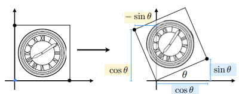  
    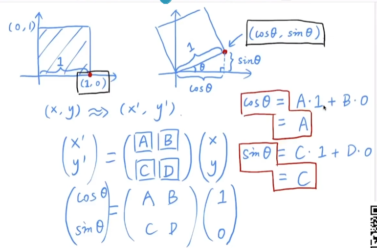  

- Translation
      

## 3. 变化可逆

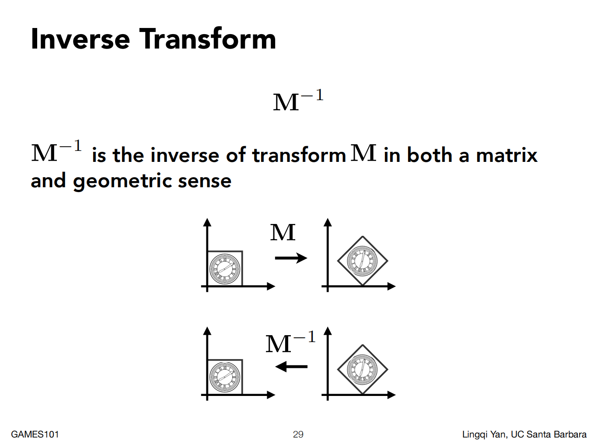
## 4. 顺序
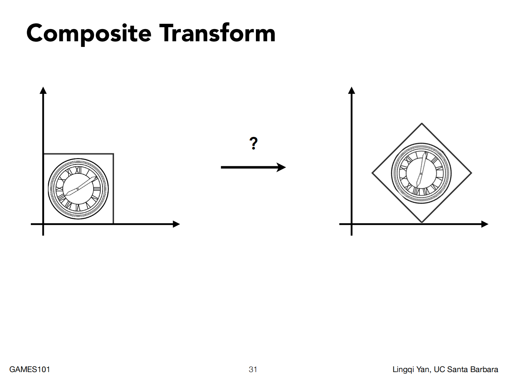
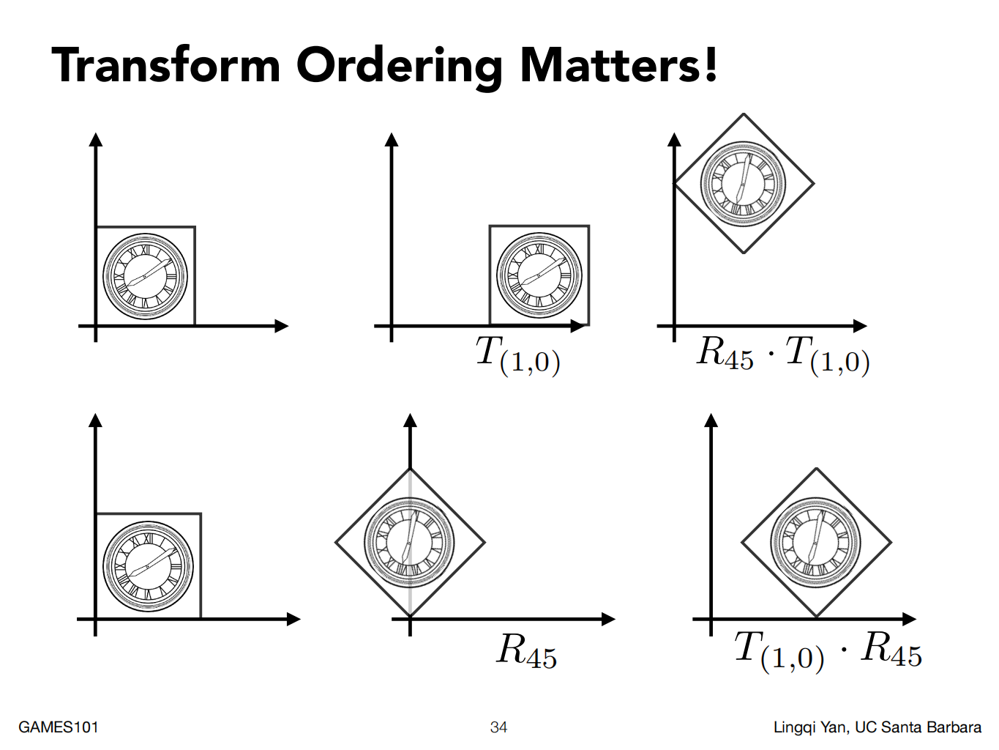
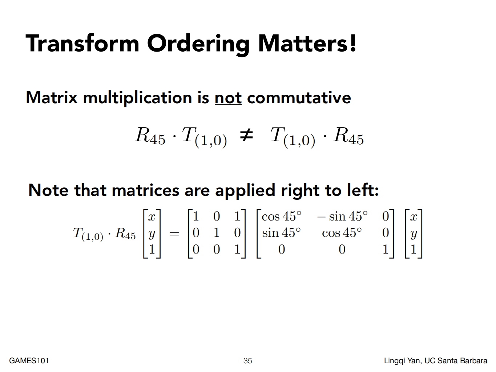
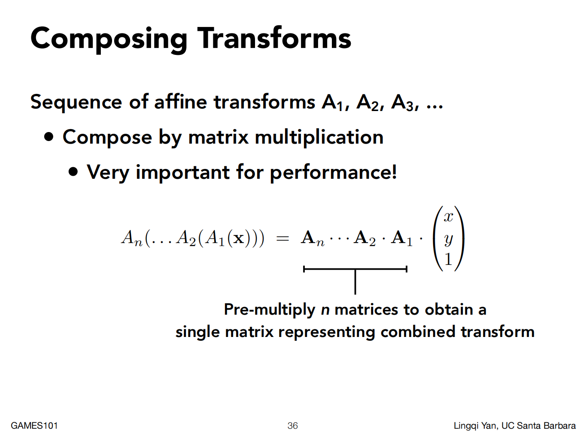

